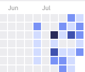
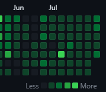

# 깃랩; 프로젝트
### 목표
- 최소 목표
  - 기본 기능으로 지정한 기능과 페이지를 완성하여 정상적으로 배포
- 최고 목표
  - 웹 RTC 기능 커스텀 및 백엔드 성능 개선
  - 애플리케이션 디자인 심미성 및 완성도 향상
  - UI/UX를 고려한 전략 구현

### 진행 과정
- 기능 명세서 및 목업(피그마)을 완성의 기준으로 삼음
  - 스프린트마다 추가사항 및 수정사항 발생

### 진척도
- 프론트엔드 : 50 %
- 백엔드 : 40 %
- 설명
  - 프론트엔드
    - 페이지 틀, CSS 관련한 부분과 API 사용 및 로직 부분을 역할 분담하여 진행중
  - 백엔드
    - 기본 기능에 대한 API는 구현 완료
      - 서비스 로직, 트랜잭션, Validation 등 디테일을 추가할 예정

### 팀원 자랑
- 부족한 실력을 메꾸기 위해 모두가 평일 개인 시간, 주말을 거의 full로 할애함
  - 디스코드 캠각코
  - 주말에도 데일리 스크럼, 위클리 미팅 진행
  - 깃랩 및 깃허브 스트릭
  
  

--- 

# 노션 메인
https://www.notion.so/BLANCA-748f64371bc94683b7ad30e056fffb93

# 회의록
## 위클리 회의
### 매주 일요일 오후 9시
모든 조원이 모여 스프린트 회고 및 각 팀(BE, FE)별 진행상황과 이슈에 대해 얘기하고 총평한 내용을 정리
위클리 회의 종료 후 다음 스프린트 목표를 구성하며 건의 사항 및 하고 싶은 말을 나눔

## 데일리 회의
### 매일 싸피 공식 일정(라이브) 종료 후, 주말 오전 9시 
모든 조원이 모여 각자의 컨디션 체크, 어제 한 일, 오늘 할 일, 이슈 및 팀원 도움 필요 등을 공유
데일리 회의 종료 후 각 팀(BE, FE)가 나뉘어 코드 리뷰 후 Merge
https://www.notion.so/d26156758fd24f898bb3a9ed9c59888a

# 협업 규칙
### 코드 컨벤션, 깃 컨벤션, 지라 컨벤션, 기술 스택 및 버전
https://www.notion.so/9b8232b71da64e96a6b00b95b8dff131

# 정보 공유 및 개인 페이지
### 공유하거나 정리해두고 싶은 모든 자료 아카이브
함께 보면 좋을 자료, 회의 중 나왔던 토의사항에 대한 정리, 프로젝트에 도움이 되는 정보 등을 정리  
개인 페이지에도 따로 정리를 해두는 팀원도 있으나 주로 정보 공유에 정리
- 개인 페이지
https://www.notion.so/To-Do-04f123e0852a4e1daa7be7512336805c
- 정보 공유
https://www.notion.so/ab53b8dc27884acb82104360c4d576a6

# 레퍼런스
### 개발에 도움이 되는 레퍼런스 아카이브
https://www.notion.so/cd29283438364f3fa66e2da403f97cfe

# 기능 명세서
### 구현할 기능들을 적고 어떤 흐름으로 이어지는 지에 대한 설명
https://www.notion.so/288c1801bd7c4946b9fcc22d15599dfb

# API 명세서
### 각 Controller별 메소드 명, 기능 설명, URL패턴 등을 정리
https://www.notion.so/API-5e5c6f1b60fe40b99b7660ab2b037ed2

# 버그 리포트
### 프로젝트 진행 중 겪었던 에러 및 고민에 대해 정리
https://www.notion.so/e18aa97251624c51ab2edd7a9a374635

# 컴포넌트 다이어그램
https://www.notion.so/c9b7804480144484b4160cd7b320ab9a

# 프로토타입
https://www.notion.so/d48a33989b864e9fa6312d7caec01820
